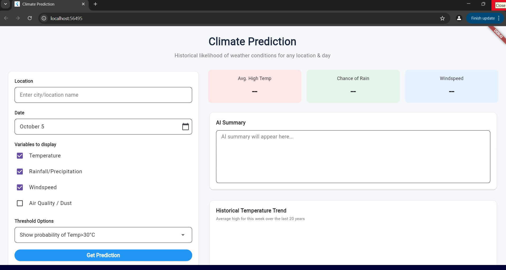

# 🌦️ Climate Prediction App



A full-stack application built for the **NASA Space Apps Challenge in Kanjirapally**.  
It provides historical climate analysis, trend visualization, and AI-powered summaries for any location selected on a map.

---

## 🌍 Features

-  **Historical Data** – Displays key metrics like average high temperature and chance of rain.  
-  **20-Year Trend Chart** – Visualizes historical temperature trends for the selected week.  
-  **AI Summary** – Uses the **Google Gemini API** to generate a conversational weather summary.  
- **Responsive UI** – Adapts seamlessly for both mobile and web/desktop platforms.

---

##  Technologies Used

| Layer | Tools / Frameworks |
|-------|--------------------|
| **Frontend** | Flutter, Dart |
| **Backend** | Python, Flask |
| **AI** | Google Gemini API |
| **Data Processing** | Pandas, Haversine |
| **Visualization** | `fl_chart` |

---
   ```bash
   cd backend
